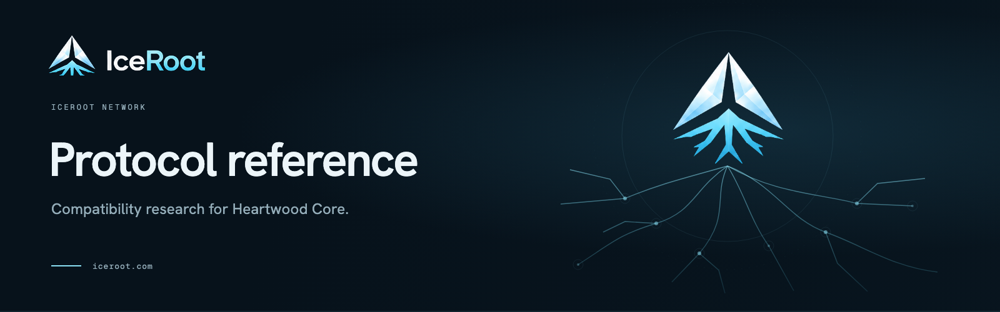

# IceRoot Protocol Reference

A pinned Solar Core reference used for Heartwood Core compatibility tests. The repository preserves the upstream implementation and IceRoot's reference patch series; it is not the Heartwood Rust node or an IceRoot mainnet installer.

[Heartwood Core](https://github.com/iceroot-network/heartwood-core) · [Compatibility testing](https://docs.iceroot.com/core/testing/) · [Core architecture](https://docs.iceroot.com/core/architecture/)

## Use as a reference

Heartwood's oracle builds this source at the selected commit or tag. Its current test baseline is `s1-ref-v2`, based on Solar Core 4.3.1. Follow the [Heartwood compatibility guide](https://github.com/iceroot-network/heartwood-core/blob/prod/docs/compatibility.md) for the pinned Node, pnpm and Docker environment, reference patches and vector generation.

Run the reference oracle with networking disabled as documented there. Do not use the upstream installation script to set up an IceRoot node.

## Changes

Keep compatibility changes explicit in the reference patch series and verify them against Heartwood's vector tests. Preserve upstream identity, copyright, licenses and acknowledgements in the reference packages.

[Contributing](https://github.com/iceroot-network/.github/blob/prod/CONTRIBUTING.md). Work on `dev`. Production changes reach `prod` through a reviewed `dev` → `prod` pull request.

## Attribution and license

Based on [Solar Core](https://github.com/solar-network/core), with its upstream ARK Core heritage. Copyright and license terms remain those in [LICENSE](LICENSE) and the individual packages. IceRoot branding of this reference repository does not replace or relicense the upstream implementation.
